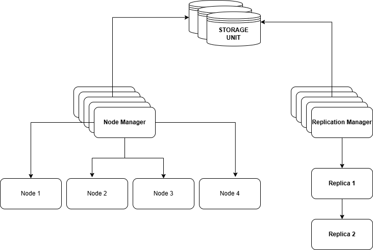

# Media Sevice (DFS)

DFS manages data storage across multiple nodes (servers), enabling scalability, fault tolerance, and high availability

## **Define Requirements**

* Features: Replication, fault tolerance, scalability, read/write consistency
* Workload: Read-heavy
* Storage Type: Object storage
* EntryPoint: Cluster Manager

## **Architecture Diagram**

For documentation follow this
https://dipghoshraj.atlassian.net/wiki/spaces/~62722c95f42962006fdf60f0/pages/98306/DFS+Media+Service
